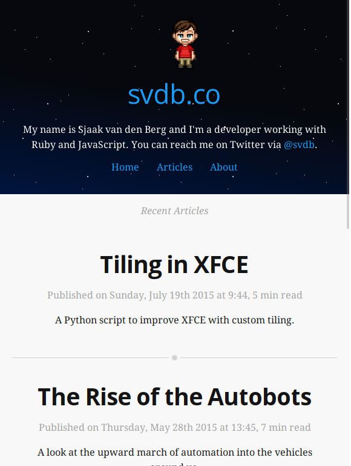

# Flexy

Flexy is a modern theme for [Hexo](https://hexo.io/), written using [Flexbox](https://philipwalton.github.io/solved-by-flexbox/).




## Demo

You can see the theme in action on my [website](https://svdb.co/).

## Usage

```
$ git clone https://github.com/sjaakvandenberg/flexy themes/flexy
$ npm un -S hexo-renderer-ejs
$ npm i -S hexo-renderer-jade
```

Change your `theme` variable to `flexy` in your root's `_config.yml`.

## Features

- Written in Jade and Stylus
- Uses Flexbox
- Responsive
- Mobile first
- CSS3 animations in header
- Uses Stylus Nib
- normalize.css
- Schema.org markup

In the header, the `transform3d()` function is used, which triggers GPUs to render the animation. This makes the page very quick to render, as the only background image is a 2.8K big SVG. It runs without using any JavaScript out of the box.

It's mobile first, so the media queries in the `source/styles/screen.styl` target the landscape screens.

## Post Variables

In the homepage post listing, you can use the `post.intro` variable to define an introduction. To do this, add the `intro` variable to your YAML in your Markdown file. Comments can be toggled with the `post.comments` boolean variable.

```md
title: The Rise of the Autobots
intro: A look at the upward march of automation into the vehicles around us.
date: 2015-05-28 13:45:00
comments: false
---
```

## Articles Page

In your root's `_config.yml`, set `filename_case` to `1`. Create a new `Articles` page by giving the `hexo new page 'Articles'` command. `layout/_content.jade` will output a yearly summary of posts.

## Fonts

This theme uses Open Sans for headings, Droid Serif for body text and Fira Mono for code. They're located in the `source/fonts` directory in `WOFF` and `WOFF2` formats.

## Problems or Improvements

If you see room for improvements, submit a [PR](https://github.com/sjaakvandenberg/flexy/pull/new/master). If you run into a problem, open an [issue](https://github.com/sjaakvandenberg/flexy/issues/new).